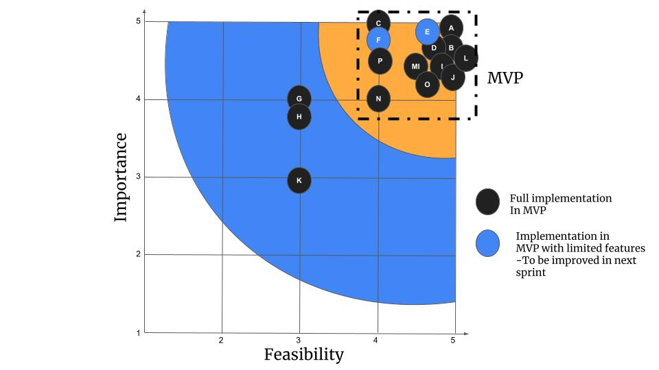
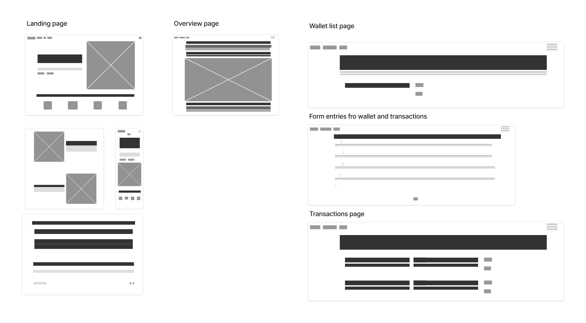

# MoneyBee
## Live webiste 	[Money Bee](https://pp4-expense-tracker-e175ccf12a09.herokuapp.com/)
## About
Money Bee is an expense tracker application. Through the app, users can track income and expenses. A user, in reality, has multiple bank accounts, credit cards and debit cards. To facilitate that, the concept of "wallet" is introduced. It represents a single bank account or a credit/debit card. As a part of MVP, a bar chart tells you total income and expenses across multiple wallets. At the moment, the user can create as many wallets as necessary. However, the user is limited to expense and income categories provided by the admin, which is to be improved in the next sprint.

## Table of Content

1. [Business Objective - Strategy Plane](#strategy-plane)
    1. [The business objective](#business-objective)
    2. [The potential user](#the-potential-user)
    3. [The user requirements](#the-user-requirements)
    4. [Task](#task)
2. [The Scope Plane](#the-scope-plane)
    1. [The feature requirements](#the-feature-requirements)
    2. [The content requirements](#the-content-requirements)
    3. [The feasibility study](#the-feasibility-study)
3. [The Structure and Skeleton Plane](#the-structure-and-skeleton-plane)
    1. [Site logic](#site-logic)
    2. [Wireframe](#wireframe)
4. [Development](#development)
    1. [Tracking development in github project](#tracking-development-in-github-project)
    2. [Testing and Debugging (while coding)](#testing-and-debugging-while-coding)
5. [Testing](#testing)
    1. [Code validation](#code-validation)
    2. [Performance](#performance)
    3. [Interactivity](#interactivity)
    4. [Responsiveness](#responsiveness)
    5. [Browser compatibility](#browswer-compatibility)
    6. [User story testing (feature testing) and manual testing (acceptance criteria testing)](#user-story-testing)

6. [Deployment](#deployment)
7. [Future Work](#future-work)
   
8. [References and Credits](#references)

# Strategy Plane

## Business Objective
To build an expense tracker application that is easy to start without friction of too much options for logging exepenses.

### The potential user

Anyone looking for tracking their spending habits. It can be userful perticularly for children so that they can learn how to manage their finances.

### The user requirements

The user wants a way to quickly log exepnses and have some visual way to look at how much he or she is spending across all credit cards and bank accounts.

### Task

Conduct research to understand UI of the similar products available on the internet. The user should feel somewhat familiar with our product, but it should give a sense of simplicity.

# The Scope Plane

### The feature requirements

1. Logo with standard navigation
2. Features of the app
3. FAQ section
4. Contact us section
5. Sign up functionality
6. Secure log in and log out
7. Password change
8. Account recovery
9. CRUD operation on transaction
10. CRUD operation on wallets
11. Budgeting
12. Snapshot of total income and expense
13. Ability to log transaction for different back accounts, cards etc
14. User can create custom spending categories
15. Back date expenses
16. Role based functionality - superuser special rights
17. 404 page

A github project is created to keep a track of these feature release as we move through development. However a feasibility study needs to be conducted to launch MVP.

### The content requirements

The user will be presented with usual landing page. Following that he can sign up or log in , that will take him to personalise view to manage his finances.A

### The feasibility study

For each of the feature requiremets listed above, a feasbility study was conducted to conclude MVP features provided time and budgeting constraint.  The matrix below represents result of such study.

**The table mentioned below will be populated as we move through development, testing and deployment stage.**

| **STAGE** | **STRATEGY**                                                            | **STRATEGY**   | **STRATEGY**    | **FEASIBILITY**                                                                                                                 | **FEASIBILITY**       | **DEVELOPMENT AND TESTING**                         | **DEVELOPMENT AND TESTING**                              | **DEVELOPMENT AND TESTING** |
| --------- | ----------------------------------------------------------------------- | -------------- | --------------- | ------------------------------------------------------------------------------------------------------------------------------- | --------------------- | --------------------------------------------------- | -------------------------------------------------------- | --------------------------- |
| **Label** | **Opportunity**                                                         | **Importance** | **Feasibility** | **Comment**                                                                                                                     | **Selected for MVP?** | **Related GitHub issue that covers the user story** | **Is user story tested and passes acceptance criteria?** | **Proof of testing**        |
| **A**     | Logo with standard navaigation                                          | 5              | 5               |                                                                                                                                 |                       |                                                     |                                                          |                             |
| **B**     | Description of the features of the app                                  | 5              | 5               |                                                                                                                                 |                       |                                                     |                                                          |                             |
| **C**     | FAQ section to improve conversions                                      | 5              | 4               |                                                                                                                                 |                       |                                                     |                                                          |                             |
| **D**     | Contact us section                                                      | 5              | 5               |                                                                                                                                 |                       |                                                     |                                                          |                             |
| **E**     | Sing up functionality                                                   | 5              | 5               | Ideal to have email based verification. If not possible due to time constraint, have it username based                          |                       |                                                     |                                                          |                             |
| **F**     | Secure log in and log out                                               | 5              | 4               | Ideal to have email based verification. If not possible due to time constraint, have it username based                          |                       |                                                     |                                                          |                             |
| **G**     | Password change                                                         | 4              | 3               | Low feasibility due to time constraint                                                                                          |                       |                                                     |                                                          |                             |
| **H**     | Account recovery                                                        | 4              | 3               | Low feasibility due to time constraint                                                                                          |                       |                                                     |                                                          |                             |
| **I**     | CRUD on transaction                                                     | 5              | 5               |                                                                                                                                 |                       |                                                     |                                                          |                             |
| **J**     | CRUD on wallets                                                         | 4              | 5               |                                                                                                                                 |                       |                                                     |                                                          |                             |
| **K**     | Budgeting                                                               | 3              | 3               |                                                                                                                                 |                       |                                                     |                                                          |                             |
| **L**     | Snapshot of total income and expense                                    | 4              | 4               |                                                                                                                                 |                       |                                                     |                                                          |                             |
| **M**     | Ability to log transaction for different back accounts and credit cards | 5              | 5               | Implement through wallet functionality ( so closely related, perhaps duplicate)                                                 |                       |                                                     |                                                          |                             |
| **N**     | Ability to back date expenses                                           | 4              | 4               | Can be covered through CRUD on transaction, but with a constraint that past dates are allowed, but future dates are not allowed |                       |                                                     |                                                          |                             |
| **O**     | Role based functionality-superuser or admin special rights              | 5              | 5               |                                                                                                                                 |                       |                                                     |                                                          |                             |
| **P**     | 404 page                                                                | 4              | 5               |                                                                                                                                 |                       |                                                     |                                                          |                             |

After ranking, the features were plotted on the following graph to select features for MVP.

# The Structure and Skeleton Plane

## Site Logic

The following [image](documentation/user_navigation_logic.png) gives an overview of user navigation on the site. **Note that this is the final product and not just MVP.**

## Wireframe

Wireframes were created only for MVP.

# Development

## Tracking development in github project

Now we have a clear idea of MVP and feature requirement. The next step is to create acceptance criteria for each of these feature requirements and create a structure for tracking development. For this purpose a [github project](https://github.com/users/ysgurjar/projects/2) is used.

**Note that github project is central repo to track all development and not just MVP. All the github issues related to MVP are tagged with "must have".**

Each issue corresponds to a user story, which again outlines feature requirements and acceptance criteria. 

So, the table created during feasibility study is now populated with some more fields as mentioned below.

| **STAGE** | **STRATEGY**                                                                       | **STRATEGY**   | **STRATEGY**    | **FEASIBILITY**                                                                                                                 | **FEASIBILITY**                  | **DEVELOPMENT AND TESTING**                                                                                                       | **DEVELOPMENT AND TESTING**                              |
| --------- | ---------------------------------------------------------------------------------- | -------------- | --------------- | ------------------------------------------------------------------------------------------------------------------------------- | -------------------------------- | --------------------------------------------------------------------------------------------------------------------------------- | -------------------------------------------------------- |
| **Label** | **Opportunity**                                                                    | **Importance** | **Feasibility** | **Comment**                                                                                                                     | **Selected for MVP?**            | **Related GitHub issue that covers the user story**                                                                               | **Is user story tested and passes acceptance criteria?** |
| **A**     | Logo with standard navaigation                                                     | 5              | 5               |                                                                                                                                 | Yes                              | [#4](https://github.com/ysgurjar/pp4_expense_tracker/issues/4)                                                                    |                                                          |
| **B**     | Description of the features of the app                                             | 5              | 5               |                                                                                                                                 | Yes                              | [#4](https://github.com/ysgurjar/pp4_expense_tracker/issues/4)                                                                    |                                                          |
| **C**     | FAQ section to improve conversions                                                 | 5              | 4               |                                                                                                                                 | Yes                              | [#3](https://github.com/ysgurjar/pp4_expense_tracker/issues/3)                                                                    |                                                          |
| **D**     | Contact us section                                                                 | 5              | 5               |                                                                                                                                 | Yes                              | [#5](https://github.com/ysgurjar/pp4_expense_tracker/issues/5)                                                                    |                                                          |
| **E**     | Sing up functionality                                                              | 5              | 5               | Ideal to have email based verification. If not possible due to time constraint, have it username based                          | Yes - with limited functionality | [#6](https://github.com/ysgurjar/pp4_expense_tracker/issues/6)                                                                    |                                                          |
| **F**     | Secure log in and log out                                                          | 5              | 4               | Ideal to have email based verification. If not possible due to time constraint, have it username based                          | Yes - with limited functionality | [#7](https://github.com/ysgurjar/pp4_expense_tracker/issues/7)                                                                    |                                                          |
| **G**     | Password change                                                                    | 4              | 3               | Low feasibility due to time constraint                                                                                          | No                               | No associated GitHub issue yet                                                                                                    |                                                          |
| **H**     | Account recovery                                                                   | 4              | 3               | Low feasibility due to time constraint                                                                                          | No                               | [#8](https://github.com/ysgurjar/pp4_expense_tracker/issues/8)                                                                    |                                                          |
| **I**     | CRUD on transaction                                                                | 5              | 5               |                                                                                                                                 | Yes                              | [#10](https://github.com/ysgurjar/pp4_expense_tracker/issues/10)                                                                  |                                                          |
| **J**     | CRUD on wallets                                                                    | 4              | 5               |                                                                                                                                 | Yes                              |                                                                                                                                   |                                                          |
| **K**     | Budgeting                                                                          | 3              | 3               |                                                                                                                                 | No                               | [#14](https://github.com/ysgurjar/pp4_expense_tracker/issues/14)                                                                  |                                                          |
| **L**     | Snapshot of total income and expense                                               | 4              | 4               |                                                                                                                                 | Yes                              | [#16](https://github.com/ysgurjar/pp4_expense_tracker/issues/16)                                                                  |                                                          |
| **M**     | Ability to log transaction for different back accounts and credit cards            | 5              | 5               | Implement through wallet functionality ( so closely related, perhaps duplicate)                                                 | Yes                              | [#9](https://github.com/ysgurjar/pp4_expense_tracker/issues/9)                                                                    |                                                          |
| **N**     | Ability to update expenses including back date expenses (no forward dates allowed) | 4              | 4               | Can be covered through CRUD on transaction, but with a constraint that past dates are allowed, but future dates are not allowed | Yes                              | [#11](https://github.com/ysgurjar/pp4_expense_tracker/issues/11)                                                                  |                                                          |
| **O**     | Role based functionality-superuser or admin special rights                         | 5              | 5               |                                                                                                                                 | Yes                              | [#2](https://github.com/ysgurjar/pp4_expense_tracker/issues/2) , [#12](https://github.com/ysgurjar/pp4_expense_tracker/issues/12) |                                                          |
| **P**     | 404 page                                                                           | 4              | 5               |                                                                                                                                 | Yes                              | [#17](https://github.com/ysgurjar/pp4_expense_tracker/issues/17)                                                                  |                                                          |

## Code validation
- All HTML pages were tested on [W3C validator]("https://validator.w3.org/#validate_by_input") --> No errors

- All CSS pages were tested on [Jigsaw validator]("https://jigsaw.w3.org/css-validator/#validate_by_input") via direct input--> No errors

- All JS pages were tested on [jshint]("https://jshint.com/") via direct input--> No errors found

- The site was tested for accessibility and contrast errors on [wave](!https://wave.webaim.org/) --> No common errors or contrast errors

### Bugs

## Future Work

## References and Credits

### References
1. [Django official documentation](https://docs.djangoproject.com/en/5.0/)
2. [Setting up Django with pipenv - medium.com](https://medium.com/python-in-plain-english/setting-up-a-basic-django-project-with-pipenv-7c58fa2ec631)
3. [Django authentication and authorisation - Youtube](https://youtu.be/WuyKxdLcw3w?feature=shared)

### Credits

1. Image credit - generated with chat-GPT 4
2. Project credit - Big thank you to my mentor [Iuliia Konovalova](https://github.com/IuliiaKonovalova) for being patient and positive throughout the project 